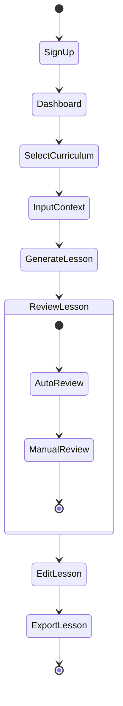
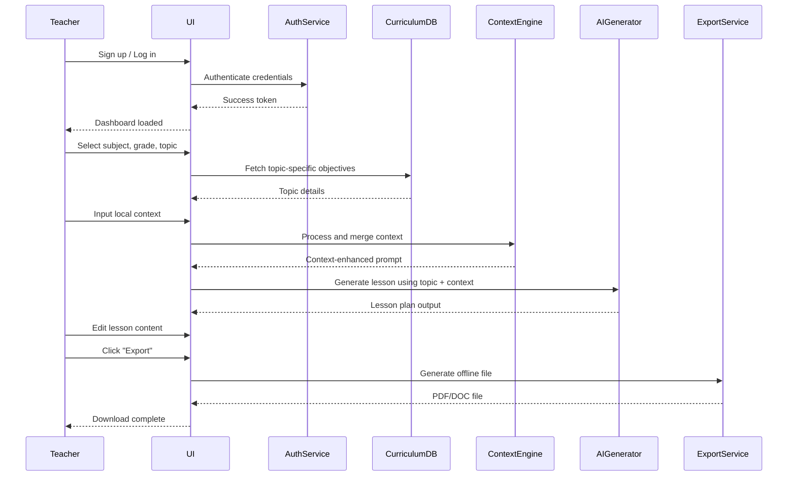

# Awade Project Workflow

## Overview

This document outlines the complete user workflow for the Awade platform, from initial signup through lesson plan generation, editing, and offline classroom use.

## 🎯 Complete User Journey

### Flowchart View
```mermaid
flowchart LR
    Start([Start])
    Signup[Sign Up / Log In]
    Dashboard[Teacher Dashboard]
    SelectCurr[Select Subject, Grade & Topic]
    InputContext[Input Local Context]
    Generate[Generate Lesson Plan]
    Edit[Edit Lesson Plan]
    Export[Export (PDF/DOC)]
    End([Offline Use in Class])

    Start --> Signup
    Signup --> Dashboard
    Dashboard --> SelectCurr
    SelectCurr --> InputContext
    InputContext --> Generate
    Generate --> Edit
    Edit --> Export
    Export --> End
```

### State Diagram View


### 🧠 Description of Activities:
- **SignUp**: Teacher creates or logs into an account.
- **Dashboard**: Entry point to start creating lessons.
- **SelectCurriculum**: Choose subject, grade, and topic.
- **InputContext**: Enter culturally/local-relevant teaching context.
- **GenerateLesson**: AI creates initial draft of the lesson.
- **ReviewLesson**: User sees a preview before proceeding.
- **EditLesson**: Modify, personalize, and enhance the AI-generated lesson.
- **ExportLesson**: Download as offline PDF/DOC for classroom use.

### 🔄 State Transitions & Review Process

#### ReviewLesson State Details:
- **AutoReview**: System automatically validates lesson plan against curriculum standards and completeness
- **ManualReview**: Teacher manually reviews the generated content for accuracy and relevance
- **Transition Logic**: AutoReview → ManualReview → Continue to EditLesson

#### Key State Transitions:
- **SignUp → Dashboard**: Successful authentication grants access to main interface
- **Dashboard → SelectCurriculum**: Teacher initiates lesson creation process
- **SelectCurriculum → InputContext**: Curriculum selection enables context input
- **InputContext → GenerateLesson**: Context data triggers AI generation
- **GenerateLesson → ReviewLesson**: Generated content enters review pipeline
- **ReviewLesson → EditLesson**: Approved content moves to editing phase
- **EditLesson → ExportLesson**: Finalized lesson plan ready for export
- **ExportLesson → [*]**: Process completion, lesson plan ready for classroom use

## 🔄 System Interactions & Data Flow

### Sequence Diagram


### 🧠 Key Actors
- **Teacher**: Main user interacting with the system.
- **UI**: Frontend interface.
- **AuthService**: FastAPI-based login/signup and session management.
- **CurriculumDB**: PostgreSQL backend containing curriculum data.
- **ContextEngine**: Logic for processing user-provided local context.
- **AIGenerator**: AI (e.g., OpenAI or hosted LLM) for lesson generation.
- **ExportService**: Converts final content into downloadable format.

### 🏗️ Service Responsibilities

#### Authentication Flow
- **AuthService**: Handles user registration, login, and session management
- **Token Management**: JWT-based authentication with secure session handling
- **Access Control**: Role-based permissions for different user types

#### Curriculum Management
- **CurriculumDB**: Stores curriculum standards, subjects, grade levels, and topics
- **Data Retrieval**: Efficient querying of curriculum data for lesson generation
- **Standards Alignment**: Mapping between curriculum standards and lesson objectives

#### Context Processing
- **ContextEngine**: Processes and enhances local context information
- **Cultural Integration**: Adapts content to local cultural and community context
- **Resource Optimization**: Considers available classroom resources and limitations

#### AI Generation
- **AIGenerator**: Creates lesson plans using AI models
- **Prompt Engineering**: Constructs effective prompts combining curriculum and context
- **Content Quality**: Ensures generated content meets educational standards

#### Export Services
- **ExportService**: Converts lesson plans to downloadable formats
- **PDF Generation**: Professional formatting with WeasyPrint
- **DOC Support**: Editable document formats for further customization

## 📋 Workflow Steps

### 1. **Authentication & Onboarding**
- **Start**: Teacher discovers Awade platform
- **Sign Up / Log In**: 
  - New users create account with email/password
  - Existing users authenticate
  - Profile setup (name, school, region, language preferences)

### 2. **Dashboard Access**
- **Teacher Dashboard**: 
  - Overview of existing lesson plans
  - Quick access to lesson plan generation
  - Curriculum mapping tools
  - Training modules
  - Recent activity and favorites

### 3. **Curriculum Selection**
- **Select Subject**: Choose from available subjects (Mathematics, Science, English, etc.)
- **Select Grade Level**: Specify target grade level (Grade 1-12)
- **Select Topic**: Choose specific curriculum topic or standard to cover

### 4. **Local Context Input**
- **Input Local Context**: Provide relevant local information:
  - Available classroom resources
  - Cultural context and community examples
  - Language preferences (English, French, Swahili, Yoruba, Igbo, Hausa)
  - Regional considerations
  - Student background and needs

### 5. **AI-Powered Generation**
- **Generate Lesson Plan**: System creates comprehensive lesson plan with:
  - Learning Objectives (aligned with curriculum standards)
  - Local Context Integration
  - Core Content (main concepts and knowledge)
  - Activities (3-5 engaging, resource-appropriate activities)
  - Quiz (5-8 assessment questions with answer key)
  - Related Projects (2-3 community-linked projects)

### 6. **Review & Customization**
- **Edit Lesson Plan**: Teachers can:
  - Modify generated content
  - Adjust activities for their specific context
  - Add or remove sections
  - Customize language and examples
  - Verify curriculum alignment

### 7. **Export & Distribution**
- **Export (PDF/DOC)**: Download lesson plan in:
  - Professional PDF format
  - Editable DOC format
  - Includes curriculum standards alignment
  - Ready for printing and sharing

### 8. **Classroom Implementation**
- **Offline Use in Class**: Teachers can:
  - Use lesson plans without internet connection
  - Print materials for classroom use
  - Share with colleagues
  - Implement in actual teaching

## 🔄 Iterative Process

The workflow supports iterative improvement:
- Teachers can return to edit lesson plans
- Generate variations for different contexts
- Build upon previous lesson plans
- Share and collaborate with other teachers

## 🎯 Key Features at Each Stage

### Authentication Stage
- Secure user registration and login
- Profile management
- Language preference settings
- Regional customization

### Dashboard Stage
- Lesson plan library
- Quick generation tools
- Curriculum mapping interface
- Training module access
- Progress tracking

### Selection Stage
- Comprehensive subject coverage
- Grade-appropriate content
- Curriculum standards alignment
- Topic-specific resources

### Context Stage
- Local resource integration
- Cultural adaptation
- Community relevance
- Accessibility considerations

### Generation Stage
- AI-powered content creation
- Standards-aligned objectives
- Resource-appropriate activities
- Local context integration
- Assessment tools

### Editing Stage
- Full content customization
- Standards verification
- Resource adjustment
- Language modification
- Activity adaptation

### Export Stage
- Multiple format support
- Professional formatting
- Curriculum alignment documentation
- Print-ready materials

### Implementation Stage
- Offline accessibility
- Classroom-ready materials
- Sharing capabilities
- Feedback collection

## 📊 Success Metrics

### User Engagement
- Time from signup to first lesson plan generation
- Frequency of lesson plan creation
- User retention rates
- Feature adoption rates

### Content Quality
- Curriculum alignment accuracy
- Local context integration effectiveness
- Teacher satisfaction scores
- Student learning outcomes

### Platform Performance
- Generation speed and reliability
- Export quality and consistency
- Offline functionality
- Cross-platform compatibility

## 🔗 Integration Points

### AI Service Integration
- GPT-powered content generation
- Curriculum standards alignment
- Local context adaptation
- Language translation support

### Database Integration
- User profile management
- Lesson plan storage and retrieval
- Curriculum mapping data
- Usage analytics

### Export Service Integration
- PDF generation with WeasyPrint
- DOC format support
- Professional formatting
- Standards documentation

### Offline Support
- Local storage capabilities
- Synchronization when online
- Print-friendly formatting
- Resource optimization

---

**Last Updated:** 2025-01-27  
**Next Review:** 2025-02-27  
**Document Owner:** Product Team  
**Status:** Active 