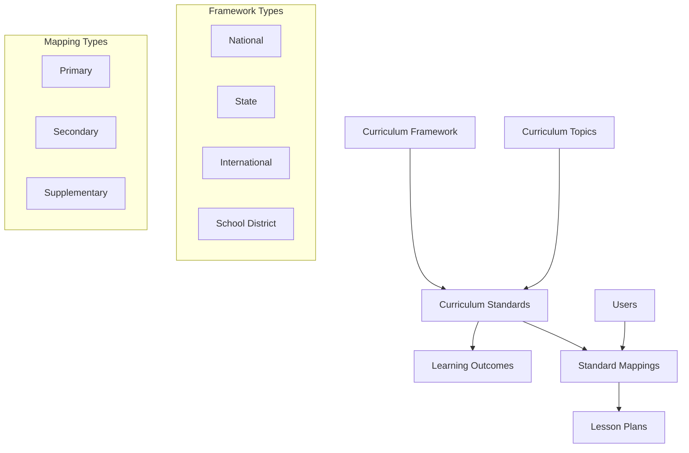

# Curriculum Mapping System

This document provides a comprehensive overview of the Awade curriculum mapping system, which enables educators to align lesson plans with curriculum standards and frameworks.

---

## 🎯 Overview

The curriculum mapping system provides a sophisticated framework for:
- **Curriculum Framework Management**: Support for national, state, international, and school district frameworks
- **Standards Organization**: Hierarchical organization of curriculum standards with strands and sub-strands
- **Learning Outcomes**: Detailed learning outcomes with success criteria and assessment methods
- **Lesson Plan Alignment**: Mapping lesson plans to curriculum standards with coverage tracking
- **Topic Management**: Hierarchical topic organization for better curriculum navigation
- **Analytics & Reporting**: Curriculum coverage analysis and popular standards tracking

---

## 🏗️ Architecture

### Core Components



### Data Flow

1. **Framework Creation**: Define curriculum frameworks (national, state, etc.)
2. **Standards Definition**: Create standards within frameworks with strands and sub-strands
3. **Learning Outcomes**: Define specific learning outcomes for each standard
4. **Topic Organization**: Organize standards into hierarchical topics
5. **Lesson Plan Mapping**: Map lesson plans to relevant standards
6. **Coverage Analysis**: Track curriculum coverage and alignment

---

## 📊 Data Models

### 1. Curriculum Framework
```sql
CREATE TABLE curriculum_frameworks (
    framework_id SERIAL PRIMARY KEY,
    name VARCHAR(255) NOT NULL UNIQUE,
    description TEXT,
    framework_type VARCHAR(50) NOT NULL, -- national, state, international, school_district
    country VARCHAR(100),
    region VARCHAR(100),
    version VARCHAR(50),
    effective_date TIMESTAMP,
    expiry_date TIMESTAMP,
    is_active BOOLEAN DEFAULT TRUE,
    created_at TIMESTAMP DEFAULT NOW(),
    updated_at TIMESTAMP DEFAULT NOW()
);
```

**Purpose**: Defines curriculum frameworks and standards bodies
**Key Features**:
- Support for multiple framework types
- Version control and effective dates
- Geographic and institutional scope
- Soft delete capability

### 2. Curriculum Standard
```sql
CREATE TABLE curriculum_standards (
    standard_id SERIAL PRIMARY KEY,
    framework_id INTEGER REFERENCES curriculum_frameworks(framework_id),
    subject VARCHAR(100) NOT NULL,
    grade_level VARCHAR(50) NOT NULL,
    standard_code VARCHAR(255) NOT NULL,
    standard_title VARCHAR(500) NOT NULL,
    standard_description TEXT NOT NULL,
    level VARCHAR(50), -- beginner, intermediate, advanced, expert
    strand VARCHAR(255), -- e.g., "Number and Operations"
    sub_strand VARCHAR(255), -- e.g., "Fractions"
    content_area VARCHAR(255), -- e.g., "Algebra", "Geometry"
    is_core BOOLEAN DEFAULT TRUE,
    created_at TIMESTAMP DEFAULT NOW(),
    updated_at TIMESTAMP DEFAULT NOW()
);
```

**Purpose**: Individual curriculum standards within frameworks
**Key Features**:
- Hierarchical organization with strands and sub-strands
- Difficulty level classification
- Core vs. supplementary standard distinction
- Framework relationship

### 3. Learning Outcome
```sql
CREATE TABLE learning_outcomes (
    outcome_id SERIAL PRIMARY KEY,
    standard_id INTEGER REFERENCES curriculum_standards(standard_id),
    outcome_type VARCHAR(50) NOT NULL, -- knowledge, skill, attitude, competency
    outcome_code VARCHAR(255),
    outcome_title VARCHAR(500) NOT NULL,
    outcome_description TEXT NOT NULL,
    success_criteria TEXT,
    assessment_methods JSON, -- Array of assessment types
    prerequisites TEXT,
    order_sequence INTEGER,
    created_at TIMESTAMP DEFAULT NOW(),
    updated_at TIMESTAMP DEFAULT NOW()
);
```

**Purpose**: Specific learning outcomes for curriculum standards
**Key Features**:
- Multiple outcome types (knowledge, skill, attitude, competency)
- Success criteria and assessment methods
- Prerequisite tracking
- Ordered sequence for progression

### 4. Standard Mapping
```sql
CREATE TABLE standard_mappings (
    mapping_id SERIAL PRIMARY KEY,
    standard_id INTEGER REFERENCES curriculum_standards(standard_id),
    lesson_plan_id INTEGER REFERENCES lesson_plans(lesson_id),
    mapping_type VARCHAR(50) NOT NULL DEFAULT 'primary', -- primary, secondary, supplementary
    coverage_percentage FLOAT, -- How much of the standard is covered (0-100)
    alignment_notes TEXT,
    created_by INTEGER REFERENCES users(user_id),
    created_at TIMESTAMP DEFAULT NOW(),
    updated_at TIMESTAMP DEFAULT NOW()
);
```

**Purpose**: Mapping between curriculum standards and lesson plans
**Key Features**:
- Multiple mapping types (primary, secondary, supplementary)
- Coverage percentage tracking
- Alignment notes for documentation
- User attribution

### 5. Curriculum Topic
```sql
CREATE TABLE curriculum_topics (
    topic_id SERIAL PRIMARY KEY,
    subject VARCHAR(100) NOT NULL,
    grade_level VARCHAR(50) NOT NULL,
    topic_name VARCHAR(255) NOT NULL,
    topic_description TEXT,
    parent_topic_id INTEGER REFERENCES curriculum_topics(topic_id),
    difficulty_level VARCHAR(50), -- beginner, intermediate, advanced, expert
    estimated_hours FLOAT, -- Estimated teaching hours
    is_core BOOLEAN DEFAULT TRUE,
    created_at TIMESTAMP DEFAULT NOW(),
    updated_at TIMESTAMP DEFAULT NOW()
);
```

**Purpose**: Topics within curriculum standards for better organization
**Key Features**:
- Hierarchical topic structure
- Difficulty level classification
- Estimated teaching time
- Self-referential relationships

---

## 🔌 API Endpoints

### Framework Management
```http
# Create framework
POST /api/curriculum/frameworks
{
  "name": "Nigerian National Curriculum",
  "description": "National curriculum framework for Nigeria",
  "framework_type": "national",
  "country": "Nigeria",
  "version": "2023",
  "is_active": true
}

# Get frameworks
GET /api/curriculum/frameworks?country=Nigeria&framework_type=national

# Update framework
PUT /api/curriculum/frameworks/{framework_id}

# Delete framework (soft delete)
DELETE /api/curriculum/frameworks/{framework_id}
```

### Standards Management
```http
# Create standard
POST /api/curriculum/standards
{
  "framework_id": 1,
  "subject": "Mathematics",
  "grade_level": "Grade 5",
  "standard_code": "MATH.5.NF.1",
  "standard_title": "Add and subtract fractions",
  "standard_description": "Students will add and subtract fractions with unlike denominators",
  "level": "intermediate",
  "strand": "Number and Operations",
  "sub_strand": "Fractions",
  "is_core": true
}

# Get standards with filtering
GET /api/curriculum/standards?subject=Mathematics&grade_level=Grade 5&strand=Number and Operations

# Search standards
GET /api/curriculum/standards/search?q=fractions&subject=Mathematics

# Get standard with details
GET /api/curriculum/standards/{standard_id}
```

### Learning Outcomes
```http
# Create learning outcome
POST /api/curriculum/standards/{standard_id}/outcomes
{
  "outcome_type": "skill",
  "outcome_title": "Add fractions with unlike denominators",
  "outcome_description": "Students can add fractions with different denominators",
  "success_criteria": "Student can solve 8/10 problems correctly",
  "assessment_methods": ["quiz", "homework", "classwork"],
  "order_sequence": 1
}

# Get learning outcomes
GET /api/curriculum/standards/{standard_id}/outcomes

# Update learning outcome
PUT /api/curriculum/outcomes/{outcome_id}
```

### Standard Mappings
```http
# Create mapping
POST /api/curriculum/mappings
{
  "standard_id": 1,
  "lesson_plan_id": 123,
  "mapping_type": "primary",
  "coverage_percentage": 85.5,
  "alignment_notes": "Lesson covers core concepts of fraction addition",
  "created_by": 1
}

# Get lesson plan mappings
GET /api/curriculum/lesson-plans/{lesson_plan_id}/mappings

# Get mappings with filtering
GET /api/curriculum/mappings?lesson_plan_id=123&mapping_type=primary

# Update mapping
PUT /api/curriculum/mappings/{mapping_id}

# Delete mapping
DELETE /api/curriculum/mappings/{mapping_id}
```

### Topics Management
```http
# Create topic
POST /api/curriculum/topics
{
  "subject": "Mathematics",
  "grade_level": "Grade 5",
  "topic_name": "Fractions and Decimals",
  "topic_description": "Understanding and operations with fractions and decimals",
  "difficulty_level": "intermediate",
  "estimated_hours": 12.5,
  "is_core": true
}

# Get topics
GET /api/curriculum/topics?subject=Mathematics&grade_level=Grade 5

# Get topic hierarchy
GET /api/curriculum/topics/hierarchy?subject=Mathematics&grade_level=Grade 5
```

### Analytics & Reporting
```http
# Get lesson plan coverage
GET /api/curriculum/lesson-plans/{lesson_plan_id}/coverage

# Get popular standards
GET /api/curriculum/standards/popular?limit=10

# Get standards by framework
GET /api/curriculum/frameworks/{framework_id}/standards

# Get utility data
GET /api/curriculum/frameworks/{framework_id}/subjects
GET /api/curriculum/frameworks/{framework_id}/grade-levels
GET /api/curriculum/strands?subject=Mathematics&grade_level=Grade 5
```

---

## 💡 Usage Examples

### 1. Setting Up a National Curriculum Framework

```python
# Create framework
framework_data = {
    "name": "Nigerian National Curriculum",
    "description": "National curriculum framework for Nigeria",
    "framework_type": "national",
    "country": "Nigeria",
    "version": "2023",
    "is_active": True
}

framework = curriculum_service.create_framework(framework_data)

# Create standards
standard_data = {
    "framework_id": framework.framework_id,
    "subject": "Mathematics",
    "grade_level": "Grade 5",
    "standard_code": "MATH.5.NF.1",
    "standard_title": "Add and subtract fractions",
    "standard_description": "Students will add and subtract fractions with unlike denominators",
    "strand": "Number and Operations",
    "sub_strand": "Fractions",
    "is_core": True
}

standard = curriculum_service.create_standard(standard_data)
```

### 2. Creating Learning Outcomes

```python
# Create learning outcomes for a standard
outcome_data = {
    "standard_id": standard.standard_id,
    "outcome_type": "skill",
    "outcome_title": "Add fractions with unlike denominators",
    "outcome_description": "Students can add fractions with different denominators",
    "success_criteria": "Student can solve 8/10 problems correctly",
    "assessment_methods": ["quiz", "homework", "classwork"],
    "order_sequence": 1
}

outcome = curriculum_service.create_learning_outcome(outcome_data)
```

### 3. Mapping Lesson Plans to Standards

```python
# Map lesson plan to standard
mapping_data = {
    "standard_id": standard.standard_id,
    "lesson_plan_id": lesson_plan.lesson_id,
    "mapping_type": "primary",
    "coverage_percentage": 85.5,
    "alignment_notes": "Lesson covers core concepts of fraction addition",
    "created_by": user.user_id
}

mapping = curriculum_service.create_standard_mapping(mapping_data)
```

### 4. Analyzing Curriculum Coverage

```python
# Get coverage summary for a lesson plan
coverage = curriculum_service.get_curriculum_coverage_summary(lesson_plan_id)

print(f"Total standards: {coverage['total_standards']}")
print(f"Coverage percentage: {coverage['coverage_percentage']}%")
print(f"Primary mappings: {coverage['primary_mappings']}")
```

---

## 🔍 Search and Filtering

### Advanced Search Capabilities

```python
# Search standards by text
standards = curriculum_service.search_standards(
    search_term="fractions",
    subject="Mathematics",
    grade_level="Grade 5"
)

# Filter standards by multiple criteria
search_params = CurriculumSearchParams(
    subject="Mathematics",
    grade_level="Grade 5",
    country="Nigeria",
    framework_type="national",
    strand="Number and Operations",
    is_core=True,
    is_active=True
)

standards = curriculum_service.get_standards(search_params)
```

### Topic Hierarchy Navigation

```python
# Get topic hierarchy
topics = curriculum_service.get_topic_hierarchy("Mathematics", "Grade 5")

for topic in topics:
    print(f"Topic: {topic.topic_name}")
    for child in topic.child_topics:
        print(f"  - {child.topic_name}")
```

---

## 📈 Analytics and Reporting

### Coverage Analysis
- **Total Standards**: Number of standards mapped to a lesson plan
- **Coverage Percentage**: Average coverage across all mapped standards
- **Mapping Types**: Breakdown of primary, secondary, and supplementary mappings
- **Alignment Quality**: Assessment of how well lesson plans align with standards

### Popular Standards Tracking
- **Most Mapped Standards**: Standards that are most frequently mapped to lesson plans
- **Usage Patterns**: Understanding which standards are most relevant to educators
- **Gap Analysis**: Identifying standards that need more lesson plan coverage

### Framework Analytics
- **Standards Distribution**: How standards are distributed across subjects and grade levels
- **Framework Adoption**: Which frameworks are most commonly used
- **Geographic Distribution**: Regional patterns in framework usage

---

## 🛠️ Implementation Notes

### Performance Considerations
- **Indexing**: Comprehensive indexes on frequently queried fields
- **Caching**: Cache framework and standard data for faster lookups
- **Pagination**: Support for large result sets with pagination
- **Search Optimization**: Full-text search capabilities for standards

### Data Integrity
- **Foreign Key Constraints**: Ensure referential integrity
- **Validation**: Comprehensive input validation for all fields
- **Soft Deletes**: Preserve data while allowing logical deletion
- **Audit Trail**: Track changes with created_at and updated_at timestamps

### Scalability
- **Modular Design**: Separate concerns for frameworks, standards, and mappings
- **Flexible Relationships**: Support for complex curriculum structures
- **Extensible Schema**: Easy to add new fields and relationships
- **API Versioning**: Support for API evolution over time

---

## 🔮 Future Enhancements

### Planned Features
1. **Bulk Import/Export**: CSV/Excel import/export for curriculum data
2. **Version Control**: Track changes to standards over time
3. **Collaborative Mapping**: Allow multiple educators to contribute mappings
4. **AI-Powered Suggestions**: Suggest relevant standards for lesson plans
5. **Advanced Analytics**: Machine learning insights for curriculum optimization

### Integration Opportunities
1. **External Curriculum APIs**: Integration with national curriculum databases
2. **Assessment Platforms**: Connect with assessment and testing systems
3. **Learning Management Systems**: Integration with LMS platforms
4. **Professional Development**: Link to teacher training and development programs

---

**Last Updated**: 2025-01-27  
**Version**: 1.0  
**Maintained by**: Development Team 