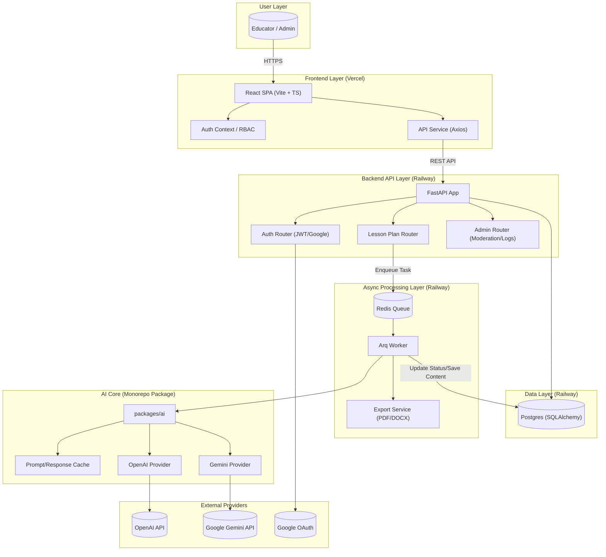

# Awade Comprehensive Architecture Diagram

This document contains a more detailed representation of the Awade system architecture, including the latest additions like Gemini support, Admin RBAC, and hybrid cloud deployment.

## High-Level Architecture (Mermaid)

## Component Breakdown

1.  **Frontend (React/Vite)**: Hosted on Vercel. Managed independently for fast iteration.
2.  **Backend (FastAPI)**: Hosted on Railway. Unified API handling the monorepo logic.
3.  **Packages**: 
    - `packages/ai`: Encapsulates multi-provider AI logic, retry strategies, and response fixing.
4.  **Worker (Arq)**: Offloads heavy AI generation and document exporting to background threads.
5.  **Multi-Model Strategy**: Seamlessly switches or tiers between OpenAI and Gemini for cost/performance optimization. 
