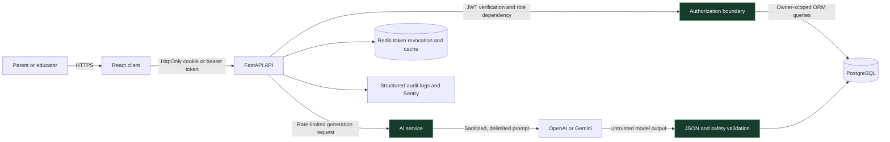

# Securing Awade: Identity, Child Data and AI-Generated Learning Content

> An evidence-backed application and AI security case study for an education platform serving parents and teachers across Africa.

## At a glance

| | |
|---|---|
| **Product** | Awade — curriculum-aligned lesson resources for teachers and practical learning guides for parents |
| **My role** | Founder, full-stack engineer and security reviewer |
| **Stack** | React, TypeScript, FastAPI, Python, PostgreSQL, SQLAlchemy, JWT, Redis and OpenAI/Gemini providers |
| **Review focus** | Authentication, role-based access, child-data ownership, session lifecycle, abuse prevention and OWASP risks for LLM applications |
| **Validation** | Source review plus 166 backend security tests and 16 frontend API/sanitizer tests |
| **Outcome** | Strong route-level authorization, token controls and AI guardrails; no new Critical or High findings |

## Why security matters here

Awade helps teachers create locally relevant lesson resources and helps parents support a child's learning at home. The friendly user experience sits on top of sensitive boundaries:

- parent and educator accounts;
- child profiles containing names, grades and curriculum context;
- role-restricted administration;
- AI-generated educational material;
- downloadable PDF content; and
- paid external model capacity.

I reviewed the application as both its builder and an internal security analyst. The aim was to prove which controls are actually enforced, test the important boundaries and document what remains—not to make a vague “secure AI” claim.

## Architecture and trust boundaries

The browser is not the security boundary. FastAPI dependencies authenticate the caller and enforce roles. Service-layer ownership checks constrain database access. Model input and output cross separate validation boundaries.

## Threat model

The review used abuse cases informed by the OWASP Web Top 10 and OWASP Top 10 for LLM Applications.

| Threat | Security objective | Verified control |
|---|---|---|
| Call a protected endpoint without a valid session | Enforce authentication consistently | Protected routes use JWT-backed FastAPI dependencies; tokens may arrive through an HttpOnly cookie or bearer header |
| Use a parent account as an educator or administrator | Prevent role escalation | Route dependencies require explicit `PARENT`, `EDUCATOR`, `ADMIN` or `SUPER_ADMIN` roles |
| Read or change another parent's child profile | Enforce object-level ownership | Child services query through the authenticated parent identity; dedicated authorization tests cover cross-user access |
| Continue using a revoked session | Support containment and logout | Refresh tokens are blacklisted in Redis and auth cookies are deleted on logout |
| Discover whether an email is registered | Reduce account enumeration | Signup, login and password-reset flows use generic errors and rate limits |
| Flood authentication or AI endpoints | Reduce credential attacks and denial-of-wallet | Route-specific limits cover signup, login, reset, child actions and AI generation |
| Inject instructions through educator or curriculum text | Keep data from becoming model instructions | User content is truncated, scrubbed for injection patterns and placed inside explicit data delimiters |
| Persist unsafe or malformed model output | Treat AI output as untrusted | Responses are parsed, checked against expected structures and screened for PII, jailbreak phrases and harmful child-facing content |
| Render AI content as executable HTML | Prevent client-side injection | The React application renders structured content; risky raw-HTML paths are not used for model output |
| Stall workers through external services | Bound remote dependency latency | OpenAI, Gemini and Google OAuth integrations use explicit request timeouts |

## Security design

### 1. Central authentication and role enforcement

Awade accepts a JWT from an `access_token` HttpOnly cookie or an Authorization bearer header. Verification fixes the accepted algorithm and rejects expired, invalid or incomplete tokens.

After verification, the API loads the user from PostgreSQL and rejects suspended accounts. Reusable dependencies then enforce the exact route audience:

- educators for lesson-plan generation;
- parents, admins or super-admins for child workflows;
- admins or super-admins for administrative routes; and
- all four application roles only where a feature truly supports them.

Production does not silently fall back to a known development secret. The fallback is limited to explicit development and test environments; unknown or production-like environments fail closed when the JWT secret is absent.

### 2. Object-level authorization for child data

Role checks answer “may a parent use this feature?” Ownership checks answer the equally important question: “may this parent use it for this child?”

Child profiles, guides and exports flow through authenticated parent context and owner-scoped service queries. Administrator access uses a separate elevated dependency and audit path rather than weakening parent ownership checks.

This separation directly addresses broken object-level authorization, one of the most common API security failures.

### 3. Session lifecycle and account protection

Authentication endpoints have dedicated request budgets:

- signup and password reset: 5 requests per minute;
- login and Google authentication: 10 requests per minute;
- refresh: 20 requests per minute.

Passwords use bcrypt. Access and refresh tokens are delivered through HttpOnly cookies. Logout blacklists the refresh token in Redis before deleting both cookies.

Registration and password-reset responses avoid revealing whether a specific account exists. Tests cover enumeration resistance, token behaviour, cookies, suspension and exception sanitisation.

### 4. Least-privilege administration and auditability

The admin router applies an elevated-role dependency at the router boundary. Sensitive actions—role changes, suspensions, moderation and child-data access—retain explicit dependencies and rate limits.

Authenticated request identity is attached to request state after all authentication guards pass, allowing the audit middleware to attribute administrative and sensitive activity without logging raw tokens.

### 5. Bounded AI generation

Lesson-resource and parent-guide generation endpoints have tighter limits than ordinary reads. Provider calls use explicit timeouts, and output size is bounded through configured token limits.

Awade uses a provider abstraction rather than giving the model tools or write access. The model returns content; application code validates it before persistence. This sharply limits excessive agency.

Caching reduces repeated model calls for equivalent generation inputs. Model and SDK versions are selected server-side and dependencies are pinned rather than using floating `latest` releases.

### 6. Prompt-injection defences

User-supplied local context is treated as data, not trusted instructions.

Before prompt construction, Awade:

- removes prompt-delimiter escape tags;
- redacts API-key, email and phone-number patterns;
- truncates user context to a documented maximum;
- detects and scrubs common injection and jailbreak phrases; and
- records suspicious attempts through application logging.

Prompt templates place user or curriculum values inside `<user_context>` or `<curriculum_data>` boundaries and explicitly tell the model not to follow instructions found there.

### 7. Output validation and child-facing safety

Model output does not go straight to the database or browser.

The service parses JSON, validates required structures and scans output for:

- email addresses, phone numbers and API-key patterns;
- signs that a prompt-injection attempt succeeded; and
- clearly harmful material inappropriate for child-facing educational content.

Parent-guide output receives its own schema validation. Invalid output fails safely or follows a controlled fallback path rather than being treated as trusted content.

### 8. Secure document generation

PDF export is a distinct trust boundary because HTML-to-PDF engines can introduce file and network access risks. Awade has focused tests for PDF input validation, unsafe HTML content and import behaviour, alongside authorization and rate limits on export endpoints.

## Verification evidence

The portfolio review reused the repository's full security scan and added focused regression runs.

| Validation group | Result |
|---|---:|
| Authentication, token lifecycle, access control, rate limiting, AI sanitisation and PDF security | **166 passed** |
| Frontend redirect/input sanitizer and API client behaviour | **16 passed** |
| Secret and sensitive-file checks from the daily security scan | **Passed** |
| Route-level auth and role review | **No missing guards found** |
| New Critical or High findings | **None** |

The backend run emitted dependency deprecation warnings and could not write its local pytest cache because this review used a read-only project mount. Neither affected the test results.

## Residual risks and honest limitations

| Risk | Status | Treatment |
|---|---|---|
| AI provider key-rotation date is not recorded | Open High issue **AWD-H-73** | Record the last rotation, rotate if unknown or overdue, and establish a recurring schedule |
| Frontend React Router advisories remain visible in the dependency audit | Mitigated / accepted | Redirect paths are sanitized; the second advisory affects SSR hydration while Awade is client-rendered only |
| Several backend and AI SDK packages have newer major releases | Maintenance | Assess through dependency-security review rather than forcing breaking upgrades without tests |
| AI safeguards are probabilistic | Continuous risk | Retain layered input/output gates, red-team fixtures, rate limits, model pinning and human review of educational content |
| Child privacy obligations vary by launch country | Governance | Review COPPA, GDPR and applicable African data-protection requirements before entering a new jurisdiction |

## What I learned

The most important security improvement was not a single regex or middleware setting. It was making authorization composable and difficult to forget.

Authentication, active-account status, roles and ownership answer different questions. Keeping them separate makes reviews clearer and tests more precise.

The AI lesson was similar: a model call needs its own trust boundaries. Delimiters alone are not enough. Sanitisation, length limits, request budgets, timeouts, structured validation, content screening and safe rendering work together.

## Skills demonstrated

- FastAPI authentication and authorization dependencies
- JWT verification, HttpOnly cookies and Redis-backed revocation
- Role-based and object-level access control
- Account-enumeration resistance and abuse prevention
- PostgreSQL and SQLAlchemy security review
- Audit logging and security monitoring
- OWASP Web and LLM threat modelling
- Prompt-injection mitigation
- Structured AI-output validation
- Child-data privacy and safety analysis
- Secure PDF-generation review
- Evidence-backed security testing

## Portfolio summary

I reviewed and hardened Awade, an AI-powered education platform, across authentication, role-based access, child-data ownership and model boundaries. I implemented JWT and HttpOnly-cookie controls, Redis-backed token revocation, rate-limited sensitive routes, prompt-injection defences and structured AI-output validation, then verified the design through focused security tests and an explicit residual-risk register.

---

This publication intentionally excludes secrets, production identifiers, real account or child data, internal prompt details and actionable exploit reproduction steps. Testing was limited to source review and authorized automated tests.

> 📝 **Feedback prompt**: If you revise this output significantly before using it, please log it — `"Log feedback: security-agent output was [approved / revised / rejected] — [what changed]"`
